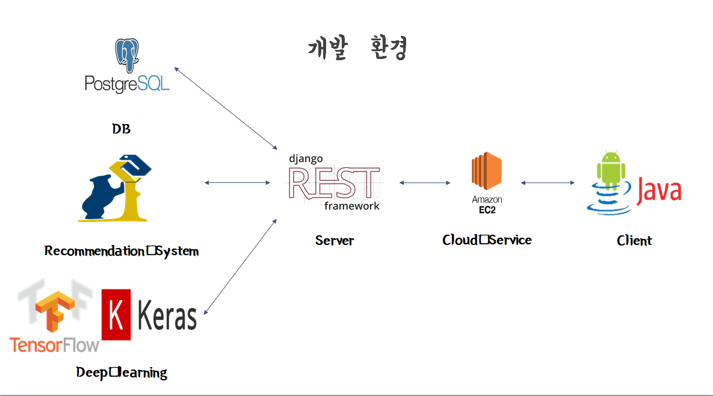
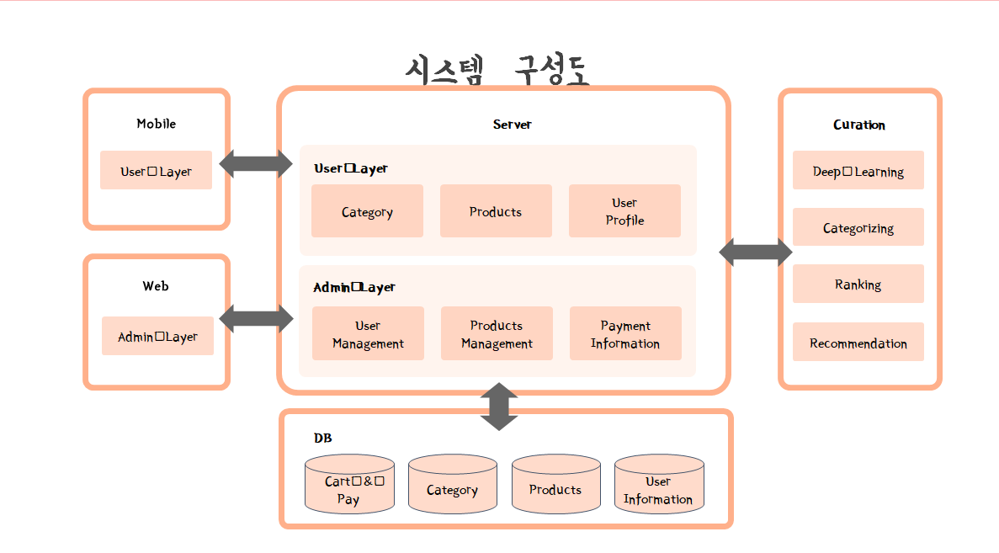
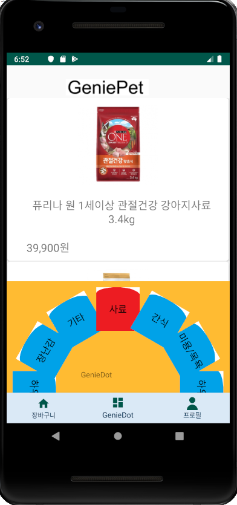
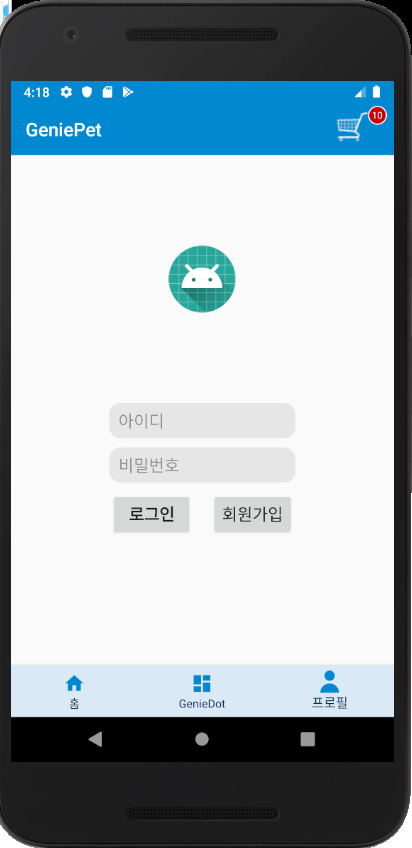
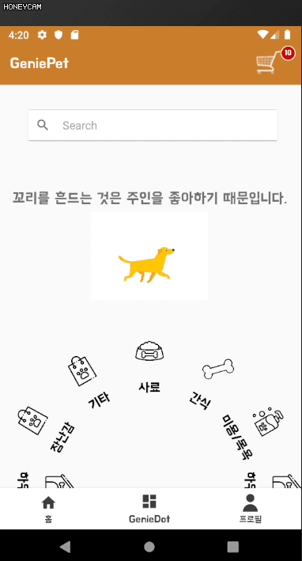
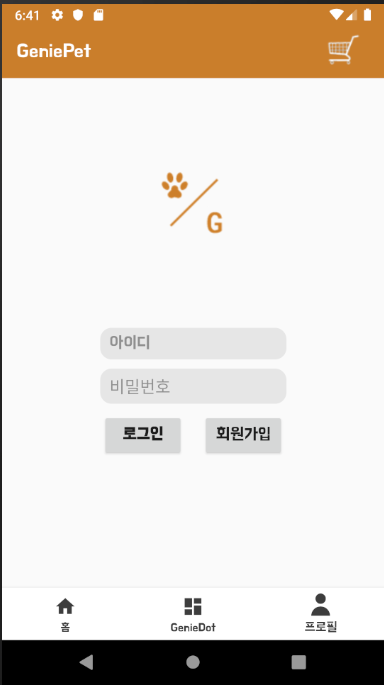
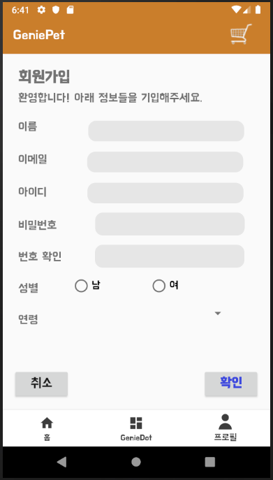

# GeniePet_Client

# 진행상황
|일시 | 할 일|
|---| --------------------- |
|~ 2019.10.09|    딥러닝 모델(견종 파악), 서버와 통신 코드        |   
|2019.10.10|    홈메인, BottomNavigation 완성     |  
|2019.10.11 |    홈메인 + 바텀바 + 서클메뉴 합치기 완성     |   
|2019.10.12|    상품페이지 추가, 로그인 페이지 구현중     |   
|2019.10.14|    로그인(JWT 토큰), 로그아웃, 자동로그인 구현     |   
|2019.10.15 ~ 16|    메인에다 카메라(딥러닝 견종 적용), 프로필생성(토큰 잘 안넘어옴) 추가     |   
|~ 2019.10.28 |    UI 꾸밈, 전반적으로 코드 수정 및 정리, 회원가입, 툴바 추가     |   
|2019.10.29 |    UI 전체 색 바꾸기, 레이아웃 살짝 손봄     |   
|2019.11.2 ~  |    Code refactoring     |   
|2019.11.13  |    상세보기 페이지 추가     |   
|2019.11.14  |    추천알고리즘 연결     |   
|2019.11.15  |    Tip 랜덤 받기 연결     |   
|2019.11.21  |     Detail페이지 UI 수정    |   
|2019.11.22~25  |     CartPage추가 및 CartPage기능추가 및 AppBar추가    |   
|2019.11.25~  |    APP실행 오류 해결 및 UI    |   
|2019.11.28  |    Camera 이미지 클릭시 카메라 이동, 카테고리 추가, UI변경    |   
|2019.12.1  |    앱 테스트 및 에러 수정    |   
|2019.12.4  |        |   

## 개발환경

------
## 시스템 구성도

---
# 사진

 

 

